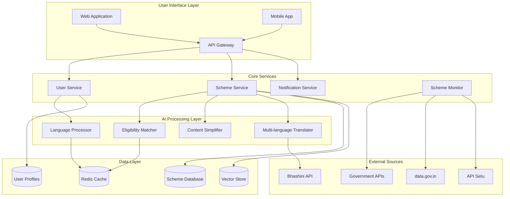

# Design Document: Welfare Scheme Assistant

## Overview

The Welfare Scheme Assistant is an AI-powered platform that democratizes access to Indian government welfare schemes through intelligent matching, natural language processing, and proactive notifications. The system addresses the critical gap between complex government documentation and citizen understanding by leveraging modern AI technologies to simplify, translate, and personalize welfare scheme information.

The platform serves as an informational bridge, not a replacement for official government portals, focusing on discovery, understanding, and guidance rather than direct application submission.

## Architecture

The system follows a microservices architecture with clear separation between AI processing, data management, and user interface components:



## Components and Interfaces

### 1. Language Processor (NLP Engine)

**Purpose**: Handles natural language understanding, question answering, and content processing.

**Key Functions**:
- Parse user queries and extract intent
- Process incomplete or informal user responses
- Generate contextual answers to scheme-related questions
- Maintain conversation context for follow-up questions

**Technology Stack**: 
- Large Language Model (LLM) for text understanding and generation
- Named Entity Recognition (NER) for extracting user demographics
- Intent classification for query routing
- Vector embeddings for semantic search

**Interfaces**:
```typescript
interface LanguageProcessor {
  parseUserInput(input: string, context?: ConversationContext): ParsedInput
  answerQuestion(question: string, schemes: Scheme[]): Answer
  extractUserProfile(responses: string[]): UserProfile
  maintainContext(sessionId: string, interaction: Interaction): void
}
```

### 2. Eligibility Matcher

**Purpose**: Matches users to relevant government schemes based on their profile and priorities.

**Key Functions**:
- Analyze user demographics against scheme eligibility criteria
- Score and rank schemes by relevance and potential benefit
- Handle complex eligibility rules with multiple conditions
- Provide explanations for matching decisions

**Matching Algorithm**:
- Rule-based matching for explicit eligibility criteria
- ML-based scoring for relevance and priority ranking
- Fuzzy matching for handling incomplete user information

**Interfaces**:
```typescript
interface EligibilityMatcher {
  findMatchingSchemes(profile: UserProfile): ScoredScheme[]
  explainMatch(scheme: Scheme, profile: UserProfile): MatchExplanation
  updateMatching(profileChanges: ProfileUpdate): ScoredScheme[]
  validateEligibility(scheme: Scheme, profile: UserProfile): EligibilityResult
}
```

### 3. Content Simplifier

**Purpose**: Converts complex government documentation into simple, accessible language.

**Key Functions**:
- Simplify technical and legal language
- Maintain accuracy while improving readability
- Generate structured explanations (benefits, eligibility, documents, steps)
- Adapt content for different education levels

**Simplification Strategy**:
- Use controlled vocabulary and shorter sentences
- Replace jargon with common terms
- Add explanatory context for necessary technical terms
- Structure information hierarchically

**Interfaces**:
```typescript
interface ContentSimplifier {
  simplifySchemeDescription(scheme: Scheme): SimplifiedScheme
  explainEligibility(criteria: EligibilityCriteria): SimpleExplanation
  generateApplicationGuide(scheme: Scheme): StepByStepGuide
  adaptForEducationLevel(content: string, level: EducationLevel): string
}
```

### 4. Multi-language Translator

**Purpose**: Provides regional language support for Indian languages.

**Key Functions**:
- Translate scheme information to regional languages
- Handle user queries in multiple languages
- Maintain simplification quality across languages
- Support code-mixing and transliteration

**Technology Integration**:
- Bhashini API for official Indian language support
- Custom models for domain-specific terminology
- Fallback to general translation services

**Interfaces**:
```typescript
interface MultiLanguageTranslator {
  translateScheme(scheme: SimplifiedScheme, targetLanguage: Language): TranslatedScheme
  translateQuery(query: string, sourceLanguage: Language): string
  detectLanguage(text: string): Language
  getSupportedLanguages(): Language[]
}
```

### 5. Scheme Monitor

**Purpose**: Continuously monitors government sources for new scheme announcements.

**Key Functions**:
- Scrape and monitor official government websites
- Parse new scheme announcements
- Extract structured information from unstructured sources
- Trigger notifications for relevant users

**Data Sources**:
- data.gov.in Open Government Data Platform
- API Setu government APIs
- Ministry websites and press releases
- State government portals

**Interfaces**:
```typescript
interface SchemeMonitor {
  monitorSources(): void
  parseNewScheme(rawData: string): Scheme
  identifyRelevantUsers(scheme: Scheme): UserId[]
  scheduleNotifications(scheme: Scheme, users: UserId[]): void
}
```

### 6. Notification Engine

**Purpose**: Manages user notifications for new schemes and updates.

**Key Functions**:
- Send in-app notifications for new relevant schemes
- Manage notification preferences and frequency
- Generate personalized notification content
- Track notification delivery and engagement

**Notification Types**:
- New scheme alerts
- Application deadline reminders
- Scheme updates and changes
- Personalized recommendations

**Interfaces**:
```typescript
interface NotificationEngine {
  sendSchemeAlert(userId: UserId, scheme: Scheme): void
  managePreferences(userId: UserId, preferences: NotificationPreferences): void
  generateNotificationContent(scheme: Scheme, profile: UserProfile): NotificationContent
  trackEngagement(notificationId: string, action: EngagementAction): void
}
```

## Data Models

### User Profile
```typescript
interface UserProfile {
  id: string
  demographics: {
    age: number
    education: EducationLevel
    income: IncomeRange
    occupation: string
    location: Location
    category: SocialCategory
  }
  preferences: {
    languages: Language[]
    notificationFrequency: NotificationFrequency
    interests: SchemeCategory[]
  }
  privacy: {
    dataRetention: RetentionPeriod
    shareProfile: boolean
  }
  createdAt: Date
  updatedAt: Date
}
```

### Scheme
```typescript
interface Scheme {
  id: string
  name: string
  description: string
  simplifiedDescription?: string
  eligibility: EligibilityCriteria
  benefits: Benefit[]
  requiredDocuments: Document[]
  applicationProcess: ApplicationStep[]
  deadlines: Deadline[]
  officialLinks: string[]
  category: SchemeCategory
  level: GovernmentLevel // Central, State, District
  status: SchemeStatus
  lastUpdated: Date
}
```

### Eligibility Criteria
```typescript
interface EligibilityCriteria {
  age?: AgeRange
  income?: IncomeRange
  education?: EducationLevel[]
  occupation?: string[]
  location?: Location[]
  category?: SocialCategory[]
  gender?: Gender
  customRules?: Rule[]
}
```

### Notification
```typescript
interface Notification {
  id: string
  userId: string
  schemeId: string
  type: NotificationType
  title: string
  content: string
  language: Language
  priority: Priority
  status: NotificationStatus
  createdAt: Date
  deliveredAt?: Date
  readAt?: Date
}
```

Now I need to use the prework tool to analyze the acceptance criteria before writing the correctness properties.
## Correctness Properties

*A property is a characteristic or behavior that should hold true across all valid executions of a system—essentially, a formal statement about what the system should do. Properties serve as the bridge between human-readable specifications and machine-verifiable correctness guarantees.*

### Property 1: Natural Language Understanding Consistency
*For any* user input in any supported language (complete, incomplete, or mixed), the Language_Processor should extract available information and maintain consistent understanding across different input formats and languages.
**Validates: Requirements 1.2, 1.3, 4.1, 6.4**

### Property 2: Profile Update Propagation
*For any* user profile change, the system should automatically trigger re-evaluation of scheme eligibility and update all dependent recommendations.
**Validates: Requirements 1.5, 2.4**

### Property 3: Comprehensive Scheme Analysis
*For any* user profile, the Eligibility_Matcher should analyze the profile against all available schemes and return results prioritized by relevance and potential benefit.
**Validates: Requirements 2.1, 2.2, 2.3**

### Property 4: Recommendation Transparency
*For any* scheme recommendation, the system should provide clear explanations for why the scheme was recommended based on the user's profile.
**Validates: Requirements 2.5**

### Property 5: Content Simplification Quality
*For any* government scheme document, the Language_Processor should convert it to simple language while including all essential information (benefits, eligibility, documents, steps) and providing definitions for necessary technical terms.
**Validates: Requirements 3.1, 3.2, 3.3**

### Property 6: Content Synchronization
*For any* scheme that gets updated in the source data, the system should refresh all derived content including simplified explanations and translations.
**Validates: Requirements 3.5**

### Property 7: Question Answering Completeness
*For any* answerable question about government schemes, the system should provide contextual answers that reference specific schemes and include relevant details.
**Validates: Requirements 4.2, 4.4**

### Property 8: Error Handling Transparency
*For any* question that cannot be answered with available information, the system should clearly indicate its limitations and suggest alternative resources.
**Validates: Requirements 4.3**

### Property 9: Conversation Context Maintenance
*For any* sequence of related questions in a user session, the system should maintain conversation context and handle follow-up questions appropriately.
**Validates: Requirements 4.5**

### Property 10: Application Guidance Completeness
*For any* scheme with application requirements, the system should provide comprehensive step-by-step guidance including required documents, deadlines, processing times, common mistakes, precautions, and official contact information when available.
**Validates: Requirements 5.1, 5.2, 5.3, 5.4, 5.5**

### Property 11: Translation Quality Preservation
*For any* scheme information translated to a regional language, the translation should maintain accuracy and the simplified language approach of the original content.
**Validates: Requirements 6.2, 6.3**

### Property 12: Language Switching Continuity
*For any* user session, switching between supported languages should maintain session state and provide consistent functionality.
**Validates: Requirements 6.5**

### Property 13: New Scheme Processing Pipeline
*For any* newly detected government scheme, the system should create simplified summaries, identify matching users, and process notifications within the defined time window.
**Validates: Requirements 7.2, 7.3**

### Property 14: Notification Content Completeness
*For any* scheme notification sent to users, the notification should include scheme summaries and direct links to detailed information.
**Validates: Requirements 7.4, 7.5**

### Property 15: Data Privacy Compliance
*For any* user data collected or processed, the system should implement appropriate privacy measures, avoid permanent storage of sensitive data beyond matching requirements, and completely remove user information upon deletion requests.
**Validates: Requirements 8.1, 8.2, 8.5**

### Property 16: Information Disclaimer Consistency
*For any* scheme information displayed, the system should include appropriate accuracy disclaimers, update date indicators for potentially outdated information, and links to official sources for verification.
**Validates: Requirements 9.2, 9.4, 9.5**

### Property 17: Offline Content Availability
*For any* scheme information previously viewed by a user, the system should provide offline access when network connectivity is unavailable.
**Validates: Requirements 10.4**

### Property 18: Performance Feedback Transparency
*For any* system performance degradation or loading delay, the system should provide clear feedback to users about the current loading status.
**Validates: Requirements 10.5**

## Error Handling

### Input Validation
- **Malformed User Input**: Handle incomplete, ambiguous, or contradictory user responses gracefully
- **Language Detection Failures**: Provide fallback mechanisms when language detection fails
- **Profile Inconsistencies**: Validate and resolve conflicting user profile information

### Data Processing Errors
- **Scheme Parsing Failures**: Handle malformed or incomplete government data sources
- **Translation Errors**: Provide fallback content when translation services fail
- **Matching Algorithm Failures**: Ensure graceful degradation when eligibility matching encounters errors

### External Service Dependencies
- **Government API Failures**: Implement retry mechanisms and cached fallbacks for government data sources
- **Bhashini API Outages**: Provide alternative translation methods when primary service is unavailable
- **Network Connectivity Issues**: Enable offline functionality for critical features

### AI Model Limitations
- **Hallucination Prevention**: Implement verification mechanisms to prevent AI from generating false scheme information
- **Bias Detection**: Monitor AI outputs for potential bias in scheme recommendations
- **Confidence Thresholds**: Only provide answers when AI confidence exceeds defined thresholds

## Testing Strategy

### Dual Testing Approach

The system requires both unit testing and property-based testing to ensure comprehensive coverage:

**Unit Tests** focus on:
- Specific examples of user interactions and system responses
- Integration points between AI components and data services
- Edge cases like empty inputs, network failures, and malformed data
- Concrete scenarios from user stories (e.g., "student from rural area seeks education schemes")

**Property-Based Tests** focus on:
- Universal properties that hold across all inputs and user profiles
- Comprehensive input coverage through randomization
- AI model behavior consistency across different languages and content types
- System invariants that must be maintained regardless of user actions

### Property-Based Testing Configuration

**Testing Framework**: Use Hypothesis (Python) or fast-check (TypeScript) for property-based testing
**Test Configuration**: Minimum 100 iterations per property test to ensure statistical confidence
**Test Tagging**: Each property test must reference its design document property using the format:
`**Feature: welfare-scheme-assistant, Property {number}: {property_text}**`

### AI-Specific Testing Considerations

**Content Quality Validation**:
- Generate diverse government documents and verify simplification maintains accuracy
- Test translation quality across language pairs with known ground truth
- Validate that scheme matching produces consistent results for equivalent user profiles

**Robustness Testing**:
- Test system behavior with adversarial inputs designed to trigger AI failures
- Verify graceful degradation when AI services are unavailable
- Ensure system maintains functionality with partial AI service failures

**Bias and Fairness Testing**:
- Test scheme recommendations across different demographic groups
- Verify equal access to information regardless of user background
- Monitor for systematic biases in language processing and matching algorithms

### Integration Testing

**End-to-End Workflows**:
- Complete user onboarding and scheme discovery flows
- New scheme detection and notification delivery
- Multi-language user interactions with content translation

**External Service Integration**:
- Government API data ingestion and processing
- Bhashini translation service integration
- Notification delivery system testing

### Performance and Scalability Testing

**Load Testing**:
- Concurrent user sessions with AI processing
- Bulk scheme processing and matching operations
- Notification system capacity under high user volumes

**Response Time Validation**:
- AI processing time limits for user interactions
- Scheme matching performance with large user bases
- Translation service response time requirements